# MigIQ - AI-Driven Code Migration

A reusable Agent Mesh package providing specialized agents and skills for AI-driven code migration using Claude Code's Agent Mesh architecture.

## Overview

This package provides a complete set of mesh components for code migration:
- **10 Specialized Agents** - Collaborative AI agents for migration workflows
- **24 Skills** - Reusable, focused commands across all migration phases
- **Agent Mesh Architecture** - Distributed, autonomous execution patterns
- **OpenSpec Tracking** - Structured proposals and specifications

## Architecture

The system uses a recursive workflow: **Analyze → Plan → Implement → Validate**

### Migration Workflow

```mermaid
graph TD
    User[👤 User] -->|/migration| MigrationSkill[📋 Migration Skill]

    MigrationSkill -->|1. Invoke| GraphifySkill[🗺️ /mig-graphify Skill]
    GraphifySkill -->|graphify update| KnowledgeGraph[(📊 Knowledge Graph<br/>graph.json)]

    MigrationSkill -->|2. Initialize| ProjectTracker[🎯 Project Tracker Agent]

    ProjectTracker -->|Create Tracker Project| TrackerBackend{Tracker Backend}
    TrackerBackend -->|GitHub| GitHubProjects[🐙 GitHub Projects v2]
    TrackerBackend -->|Local| TasksMD[📝 tasks.md]

    ProjectTracker -->|3. Create & Execute| InitialTasks[Initial Tasks]

    subgraph InitialTasks[Initial Tasks]
        Task001[TASK-001<br/>Analyze Codebase]
        Task002[TASK-002<br/>Plan Migration]
        Task003[TASK-003<br/>Generate Backlog]
    end

    Task001 -->|Uses| AnalyzeSkill[analyze-codebase]
    Task002 -->|Uses| PlanSkill[plan-migration]
    Task003 -->|Uses| BacklogSkill[generate-backlog]

    AnalyzeSkill -->|Reads| KnowledgeGraph
    PlanSkill -->|Reads| KnowledgeGraph

    Task001 -->|Output| AnalysisReport[📄 analysis-report.json]
    Task002 -->|Output| MigrationPlan[📄 migration-plan.json]
    Task003 -->|Creates| UserStories[📋 User Stories]

    AnalysisReport -->|Attached to| GitHubProjects
    MigrationPlan -->|Attached to| GitHubProjects

    UserStories -->|Synced to| GitHubProjects
    UserStories -->|Synced to| TasksMD

    ProjectTracker -->|4. Process Stories| StoryLoop[Story Processing Loop]

    StoryLoop -->|For Each Story| StoryOrchestrator[🎭 Story Orchestrator Agent]

    StoryOrchestrator -->|Phase 1| TestGen[🧪 Test Generator Agent]
    StoryOrchestrator -->|Phase 2| CodeRefactor[⚙️ Code Refactor Agent]
    StoryOrchestrator -->|Phase 3| BenchmarkBuilder[📊 Benchmark Builder Agent]
    StoryOrchestrator -->|Phase 4| QualityEval[✅ Quality Evaluator Agent]
    StoryOrchestrator -->|Phase 5| CIIntegration[🚀 CI Integration Agent]

    TestGen -->|Uses| CharTestSkill[generate-characterization-tests]
    TestGen -->|Uses| FuncTestSkill[generate-functional-tests]

    CodeRefactor -->|Uses| ApplyRulesSkill[apply-refactor-rules]
    CodeRefactor -->|Uses| SpecCodeSkill[generate-spec-driven-code]

    BenchmarkBuilder -->|Uses| BenchmarkSkill[build-benchmark-suite]
    BenchmarkBuilder -->|Uses| RunBenchSkill[run-benchmarks]

    QualityEval -->|Uses| ValidateCovSkill[validate-coverage]
    QualityEval -->|Uses| ValidateQualSkill[validate-quality]
    QualityEval -->|Uses| ValidateRefSkill[validate-refactoring]

    CIIntegration -->|Uses| PrepMRSkill[prepare-merge-request]
    CIIntegration -->|Uses| PushMRSkill[push-merge-request]

    StoryOrchestrator -->|On Failure| FailureAnalyzer[🔍 Failure Analyzer Agent]
    FailureAnalyzer -->|Uses| RootCauseSkill[request-root-cause]

    FailureAnalyzer -->|Autonomous Mode| ContinueLoop[Continue Next Story]
    FailureAnalyzer -->|Interactive Mode| PauseForHuman[⏸️ Pause for Human]

    StoryOrchestrator -->|Update Status| GitHubProjects
    StoryOrchestrator -->|Update Status| TasksMD

    StoryOrchestrator -->|All Phases Complete| MergeRequest[🎉 Merge Request Created]

    MergeRequest -->|Triggers| CIPipeline[CI/CD Pipeline]
    CIPipeline -->|Monitor| MonitorSkill[monitor-pipeline]

    style User fill:#e1f5ff
    style MigrationSkill fill:#fff4e6
    style GraphifySkill fill:#e8f5e9
    style ProjectTracker fill:#f3e5f5
    style StoryOrchestrator fill:#f3e5f5
    style GitHubProjects fill:#e3f2fd
    style KnowledgeGraph fill:#fff9c4
    style MergeRequest fill:#c8e6c9
```



#### Workflow Phases

**Phase 1: Setup & Analysis**
1. User invokes `/migration` skill with project path and migration type
2. `/mig-graphify` builds knowledge graph using offline AST extraction (`graphify update`)
3. Project Tracker Agent creates tracker project (GitHub Projects or tasks.md)
4. **TASK-001**: Analyzes codebase using knowledge graph → `analysis-report.json`
5. **TASK-002**: Creates migration plan → `migration-plan.json`
6. **TASK-003**: Generates user stories and syncs to tracker

**Phase 2: Story Execution**
For each user story, Story Orchestrator Agent coordinates:
1. **Test Generator Agent** - Creates characterization & functional tests
2. **Code Refactor Agent** - Applies migration rules and generates new code
3. **Benchmark Builder Agent** - Builds and runs performance benchmarks
4. **Quality Evaluator Agent** - Validates coverage, quality gates, and refactoring correctness
5. **CI Integration Agent** - Creates merge request and triggers CI pipeline

**Phase 3: Failure Handling**
- **Interactive Mode**: Pauses on first failure for human intervention
- **Autonomous Mode**: Documents failure in GitHub issue, continues with remaining stories

**Phase 4: Tracking & Visibility**
- All tasks and stories tracked in GitHub Issues with real-time status updates
- Task outputs (JSON reports, plans) attached to issues as collapsible comments
- CI/CD pipeline status monitored and reported

### Agents & Skills Reference

| Agent | Purpose | Skills Used |
|-------|---------|-------------|
| **Project Tracker Agent** | Orchestrates migration workflow | `analyze-codebase`, `plan-migration`, `generate-backlog` |
| **Story Orchestrator Agent** | Coordinates story execution through harness phases | All harness skills |
| **Test Generator Agent** | Creates characterization and functional tests | `generate-characterization-tests`, `generate-functional-tests`, `calculate-test-scores` |
| **Code Refactor Agent** | Applies refactoring rules and generates code | `apply-refactor-rules`, `generate-spec-driven-code`, `validate-refactoring` |
| **Benchmark Builder Agent** | Builds and runs performance benchmarks | `build-benchmark-suite`, `run-benchmarks`, `establish-baseline` |
| **Quality Evaluator Agent** | Validates quality gates and coverage | `validate-coverage`, `validate-quality`, `generate-evaluation-metrics` |
| **CI Integration Agent** | Creates merge requests and monitors pipelines | `prepare-merge-request`, `push-merge-request`, `monitor-pipeline`, `handle-pipeline-result` |
| **Failure Analyzer Agent** | Analyzes failures and generates remediation plans | `request-root-cause` |
| **KPI Tracker Agent** | Tracks and reports migration KPIs | `generate-kpi-metrics` |
| **Documentation Manager Agent** | Updates migration documentation | `update-documentation` |

### Tracker Integration

The agent mesh supports multiple tracker backends for managing migration user stories:

- **Local Tracker** (default) - tasks.md file-based tracking, no external dependencies
- **GitHub Projects** - Sync stories to GitHub Projects v2 via GraphQL API with auto-creation
- **GitLab Issues** (planned) - GitLab Issues integration
- **Jira** (planned) - Jira Cloud/Server integration

#### GitHub Projects Auto-Creation

The `project_number` field is now **optional**. If not specified, the tracker will automatically create a new GitHub Project:

```json
{
  "tracker": {
    "type": "github",
    "config": {
      "token": "$GITHUB_TOKEN",
      "organization": "my-org"
    }
  }
}
```

The agent will:
1. Create a new project: `Migration Agent - {org} - {timestamp}`
2. Print the project number to console
3. Suggest adding `TRACKER_GITHUB_PROJECT_NUMBER` to your .env file

Alternatively, specify an existing project:
```json
{
  "tracker": {
    "type": "github",
    "config": {
      "token": "$GITHUB_TOKEN",
      "organization": "my-org",
      "project_number": 5
    }
  }
}
```

See [agents/project-tracker-agent/README.md](./agents/project-tracker-agent/README.md) for detailed configuration.

### Code Analysis with Graphify

Agents use [graphify](https://github.com/safishamsi/graphify) for fast code analysis via knowledge graphs. This reduces analysis time by 50-70% compared to traditional Grep/Read approaches.

**How it works:**
1. Pre-execution hook builds knowledge graph (one-time, ~30s)
2. Agents query graph for dependencies, services, and architecture
3. Graphify extracts Java annotations and imports via tree-sitter AST (local, no API calls for code)
4. Migration-specific queries detect EJB patterns and javax imports
5. Fall back to Grep/Read only when graph can't answer the question

**Performance impact:**
- 50-70% faster agent execution
- 96% reduction in file reads per task
- Complete dependency understanding
- Zero infrastructure cost (AST-only, no external services)
- Local code analysis (tree-sitter AST parsing, no API calls)

**Requirements:**
- Python 3.10 or higher
- **REQUIRED**: graphify CLI tool must be installed for migration agents to work

**Setup (Required for Production):**
```bash
# 1. Install graphify CLI tool (Python package) - REQUIRED
# Option A: Using uv (recommended)
uv tool install graphifyy

# Option B: Using pipx
pipx install graphifyy

# Option C: Using pip
pip install graphifyy

# Verify installation
graphify --version

# Note: Package name is 'graphifyy' (double-y), CLI command is 'graphify'

# 2. Build initial graph (in Claude Code)
/mig-graphify .
# Uses graphify CLI for AST parsing and graph building
# Critical for Java EE migration: detects @Stateless, @MessageDriven, javax.* imports
# All analysis is local via tree-sitter - no API calls for code

# 3. Agents automatically use graph (via PreAgentExecution hook)
# Hook runs /graphify . before any agent execution to ensure graph exists
```

## Documentation

### Implementation
- **[IMPLEMENTATION.md](./IMPLEMENTATION.md)** - Complete implementation guide for project-tracker-agent
- **[Migration Flow](./docs/migration-flow.md)** - Detailed workflow and task structure

### Architecture
- **[Agent Mesh Infrastructure](./docs/agent-mesh-infrastructure.md)** - Core architecture and patterns
- **[Testing Guide](./docs/testing-guide.md)** - How to test the mesh
- **[Distributed Tracing](./docs/distributed-tracing.md)** - Mesh observability
- **[Failure Recovery](./docs/failure-recovery.md)** - Error handling and recovery
- **[KPI Tracking](./docs/kpi-tracking.md)** - Metrics and reporting

## Installation

Install dependencies:
```bash
pip install -r requirements.txt
```

Required packages:
- `python-dotenv` - .env file loading for configuration
- `requests` - HTTP client for GitHub API integration
- `pytest` - Testing framework

## Getting Started - Quick Command

Use the `install-local.sh` if you want to try this out in a project.

To start a migration, use the main `/migration` command:

```bash
/migration --project-path ./my-app --migration-type framework
```

This command:
1. Validates inputs and initializes the migration context
2. Creates `rule.md` and `tasks.md` if they don't exist
3. Delegates to `project-tracker-agent` which creates and executes tasks
4. Returns a session ID and trace ID for monitoring

## Configuration

The agent mesh supports flexible configuration via .env files (recommended) or JSON context.

### Quick Start with .env

The migration automatically loads configuration from your **project's .env file**.

1. **Create .env in your project directory:**
   ```bash
   cd ./my-app  # Your project to migrate (must be a git repo)
   cat > .env << 'EOF'
   # Tracker Configuration
   TRACKER_TYPE=github
   TRACKER_GITHUB_TOKEN=ghp_your_token_here
   TRACKER_GITHUB_ORGANIZATION=my-org
   # TRACKER_GITHUB_REPOSITORY auto-detected from git remote
   EOF
   ```

   **Repository auto-detection:**
   The migration automatically detects the GitHub repository from your project's git remote:
   - Parses `git remote get-url origin` in the project directory
   - Supports both SSH (`git@github.com:owner/repo.git`) and HTTPS formats
   - Creates real GitHub issues in that repository and links them to the project
   - Issues appear in `github.com/owner/repo/issues` and the project board

   If auto-detection fails (non-GitHub remote or no git repo), it falls back to creating draft issues (project-only).

2. **Run the migration:**
   ```bash
   cd ..  # Back to parent directory
   /migration --project-path ./my-app --migration-type framework
   ```

   The migration will automatically:
   - Load configuration from `./my-app/.env`
   - Use your GitHub token for tracker integration
   - Create/sync tasks to GitHub Projects

**Alternative: Use environment variables**
   ```bash
   export GITHUB_TOKEN="ghp_your_token_here"
   /migration --project-path ./my-app --migration-type framework
   ```

**Configuration priority:**
1. Command-line arguments (highest)
2. Project's .env file (`<project-path>/.env`)
3. Current directory's .env file
4. Environment variables
5. Defaults (lowest)

**Autonomous mode:**
Set `MODE=autonomous` in your project's .env to run the migration fully automated:
```bash
# In ./my-app/.env
MODE=autonomous
TRACKER_TYPE=github
TRACKER_GITHUB_TOKEN=ghp_xxx
TRACKER_GITHUB_ORGANIZATION=my-org
```

In autonomous mode:
- All user stories are processed without human intervention
- Failures are documented as comments in GitHub issues
- Migration continues with remaining stories even if some fail
- Perfect for overnight runs or CI/CD pipelines

### Environment Variable Naming Convention

Environment variables use `UPPERCASE_WITH_UNDERSCORES` and map to nested configuration:

| Environment Variable | Maps To | Example |
|---------------------|---------|---------|
| `TRACKER_TYPE` | `tracker.type` | `github` |
| `TRACKER_GITHUB_TOKEN` | `tracker.config.token` | `$GITHUB_TOKEN` |
| `TRACKER_GITHUB_ORGANIZATION` | `tracker.config.organization` | `my-org` |
| `TRACKER_GITHUB_REPOSITORY` | `tracker.config.repository` | `my-org/my-repo` |
| `TRACKER_GITHUB_PROJECT_NUMBER` | `tracker.config.project_number` | `5` |

### Configuration Priority

Configuration is loaded in this priority order (highest first):

1. **Explicit JSON context** (via `--context` argument)
2. **Environment variables** (from .env file)
3. **System environment variables**
4. **Default values**

### Migrating from JSON Context

If you have existing JSON context configuration, convert it to .env:

```bash
python scripts/context_to_env.py --context '{"tracker":{"type":"github",...}}' --output .env
```

See `.env.example` for all available configuration options.

## Workflow Phases

### 1. Project Tracking HARNESS
- Analyze codebase for migration needs
- Plan user stories
- Generate and maintain backlog
- Loop through each story

**Agent**: `project-tracker-agent`
**Triggered by**: `/migration` skill

### 2. Test HARNESS
- Generate characterization tests (capture current behavior)
- Generate functional tests (define expected behavior)
- Validate test coverage

**Agent**: `test-generator-agent`
**Tools**: opencode agent

### 3. Code HARNESS
- Apply automated refactoring
- Generate spec-driven code
- Validate transformations

**Agent**: `code-refactor-agent`
**Tools**: opencode agent

### 4. Benchmark HARNESS
- Build benchmark test suite
- Establish performance baselines
- Run benchmarks and compare

**Agent**: `benchmark-builder-agent`

### 5. Evaluation HARNESS
- Generate comprehensive evaluation metrics
- Calculate test scores
- Validate quality thresholds

**Agent**: `quality-evaluator-agent`
**Tools**: opencode agent

### 6. CI HARNESS
- Prepare merge requests
- Push to CI platform
- Monitor pipeline execution
- Handle results and feedback

**Agent**: `ci-integration-agent`
**Tools**: GitLab/GitHub API, opencode agent (KPI metrics)

## Agent Mesh Architecture

The system uses a **distributed mesh of specialized agents** that collaborate autonomously:

```
project-tracker-agent (Coordination Layer)
    ↓
story-orchestrator-agent (Per-story orchestration)
    ↓
    ├─ test-generator-agent ──────┐
    ├─ code-refactor-agent        ├── Parallel execution
    ├─ benchmark-builder-agent    │   where possible
    └─ quality-evaluator-agent ───┘
          ↓
    ci-integration-agent (Integration)
          ↓
    CI Platform → Kanban → (loop if needed)
```

**Supporting Agents**:
- `failure-analyzer-agent` - Root cause analysis
- `documentation-manager-agent` - Knowledge management
- `kpi-tracker-agent` - Metrics and reporting

See [AGENT-MESH.md](./AGENT-MESH.md) for detailed architecture.

## Skills Overview

The system provides **24 specialized skills** across all harness phases:

### Main Orchestration (1 skill)
- `/migration` - Main entry point to start migration workflow

### Project Tracking (3 skills)
- `/analyze-codebase` - Analyze codebase for migration needs
- `/plan-migration` - Create migration plan from analysis
- `/generate-backlog` - Generate and update Kanban backlog

### Testing (3 skills)
- `/generate-characterization-tests` - Capture current behavior
- `/generate-functional-tests` - Define expected behavior
- `/validate-coverage` - Validate coverage meets requirements

### Code (3 skills)
- `/apply-refactor-rules` - Apply refactoring using opencode agent
- `/generate-spec-driven-code` - Generate code from specifications
- `/validate-refactoring` - Validate refactored code

### Benchmarking (3 skills)
- `/build-benchmark-suite` - Compile benchmark suite
- `/establish-baseline` - Establish performance baseline
- `/run-benchmarks` - Execute and compare benchmarks

### Evaluation (3 skills)
- `/generate-evaluation-metrics` - Generate quality metrics
- `/calculate-test-scores` - Calculate test scores
- `/validate-quality` - Validate quality thresholds

### CI Integration (4 skills)
- `/prepare-merge-request` - Prepare MR with artifacts
- `/push-merge-request` - Push to CI platform
- `/monitor-pipeline` - Monitor CI pipeline
- `/handle-pipeline-result` - Handle pipeline results

### Cross-Cutting (3 skills)
- `/generate-kpi-metrics` - Generate KPI metrics
- `/update-documentation` - Update rule.md and tasks.md
- `/request-root-cause` - Root cause analysis for failures

See [skills.md](./skills.md) for complete skill documentation.

## Feedback Loops

### Success Path
```
Project Tracking → Test → Code → Benchmark → Evaluation → CI → Merge → Done
```

### Failure Path
```
CI Platform → KPI Metrics → Root Cause Analysis → Backlog → Retry
```

### Human Intervention Points

1. **Update Documentation** - Refine `rule.md` and `tasks.md`
2. **Root Cause Analysis** - Deep analysis on failures
3. **Backlog Management** - Adjust priorities and refinements

## Getting Started

### Prerequisites

- Claude Code CLI or Desktop App
- **graphify skill installed** (required for agents to work)
  ```bash
  uv tool install graphifyy && graphify install
  ```
- Target project using this mesh for code migration

### Using This Mesh

This is a **reusable mesh package** meant to be integrated into your migration project:

1. **Install Prerequisites (REQUIRED)**
   ```bash
   # Install graphify CLI tool - agents depend on this for code analysis
   uv tool install graphifyy
   # Verify installation
   graphify --version
   ```

2. **Clone or Install the Mesh**
   ```bash
   git clone <repository-url>
   cd mig-agent-mesh
   ```

2. **Review Agents**

   Explore the 10 specialized agents in `/agents/`:
   - `project-tracker-agent` - Main coordination loop
   - `story-orchestrator-agent` - Per-story orchestration
   - `test-generator-agent` - Test creation harness
   - `code-refactor-agent` - Code transformation harness
   - `benchmark-builder-agent` - Performance benchmarking
   - `quality-evaluator-agent` - Quality validation
   - `ci-integration-agent` - CI/CD integration
   - `failure-analyzer-agent` - Root cause analysis
   - `documentation-manager-agent` - Knowledge management
   - `kpi-tracker-agent` - Metrics and reporting

3. **Review Skills**

   Browse the 24 skills in `/skills/` organized by phase:
   - Project Tracking: analyze, plan, generate backlog
   - Testing: characterization tests, functional tests, coverage
   - Code: refactoring, spec-driven generation, validation
   - Benchmarking: build suite, baseline, run benchmarks
   - Evaluation: metrics, scoring, quality validation
   - CI Integration: MR preparation, pipeline monitoring
   - Cross-Cutting: KPI metrics, documentation, root cause

4. **Review OpenSpec Proposals**

   Check `/openspec/` for structured specifications and proposals

5. **Integration**

   Copy or reference agents and skills from your migration project's `.claude/` directory

### Using the Migration System

**Start a Migration (Recommended):**
```bash
# Basic migration
/migration --project-path ./my-app --migration-type framework

# With full configuration
/migration \
  --project-path ./my-app \
  --migration-type framework \
  --kanban-platform jira \
  --kanban-project PROJ-123 \
  --ci-platform gitlab

# Autonomous mode (no prompts)
/migration --project-path ./my-app --migration-type framework --mode autonomous
```

**Advanced: Run Agents Directly:**
```bash
# Start project tracker manually
claude-code agent run project-tracker-agent --context '{"sessionId":"...","traceId":"..."}'

# Run specific harness
claude-code agent run test-generator-agent --story US-123
```

**Invoke Individual Skills:**
```bash
# Analyze codebase
/analyze-codebase --path ./src --migration-type framework

# Generate tests
/generate-characterization-tests --source-path ./src/main

# Apply refactoring
/apply-refactor-rules --source-path ./src --rules-path ./rules.yml
```

## Monitoring and Observability

### KPI Dashboard

Track key metrics:
- **Migration Velocity** - Stories completed per day
- **Automation Rate** - % of migrations without human intervention
- **Quality Score** - Aggregate quality metrics
- **Cycle Time** - Time from story start to merge
- **Success Rate** - % of migrations that pass first time

### Distributed Tracing

Each story has a trace ID that flows through all agents:
```
Trace: migration-story-US123
  ├─ project-tracker-agent (10s)
  ├─ story-orchestrator-agent (300s)
  │   ├─ test-generator-agent (120s)
  │   ├─ code-refactor-agent (100s)
  │   ├─ benchmark-builder-agent (50s)
  │   └─ quality-evaluator-agent (30s)
  └─ ci-integration-agent (200s)
```

### Logs and Metrics

All agents produce:
- **Structured logs** - JSON formatted, searchable
- **Metrics** - Prometheus-compatible
- **Traces** - OpenTelemetry compatible
- **Events** - Event stream for real-time monitoring

## Supported Integrations

The mesh agents and skills are designed to integrate with:

**CI/CD Platforms:**
- GitLab - MR creation, pipeline monitoring
- GitHub - PR creation, workflow monitoring

**Kanban Boards:**
- Jira - REST API integration
- Linear - GraphQL API integration
- GitHub Projects - API integration

**Code Operations:**
- opencode agent - All code analysis, refactoring, testing, and evaluation

Your project must configure these integrations for the mesh to function.

## Success Criteria

1. **Automation Rate** - >80% of migrations complete without human intervention
2. **Quality** - All tests pass, code coverage maintained/improved
3. **Performance** - No regression in benchmark metrics
4. **Reliability** - Consistent feedback loop handling
5. **Traceability** - Full audit trail from story to merge

## Technical Stack

- **Orchestration** - Claude Code (Agent Mesh architecture)
- **Languages** - Java, Python, JavaScript (examples)
- **Code Operations** - opencode agent (all analysis, refactoring, testing, evaluation)
- **CI/CD** - GitLab, GitHub
- **Tracking** - Jira, Linear, GitHub Projects

## Package Status

**Current State**: Core mesh components with working implementation

**Included**:
- ✅ 10 Specialized agents (1 implemented: project-tracker-agent)
- ✅ 24 Migration skills
- ✅ Agent Mesh architecture documentation
- ✅ OpenSpec proposal tracking
- ✅ Core operational docs
- ✅ Tasks.md template for tracking
- ✅ Working migration orchestration flow

**Implemented & Ready**:
- ✅ `/migration` command - Main entry point
- ✅ `project-tracker-agent` - Full Python implementation
  - Executes initial tasks (analyze, plan, generate-backlog)
  - Parses and updates tasks.md
  - Processes user stories
  - Integrates with Kanban (simulated)
- ✅ TasksFileManager - tasks.md parsing and updates
- ✅ Session and trace ID generation
- ✅ Error handling and status tracking

**Usage**:
This is a **reusable mesh package**. To use it:
1. Clone this repository
2. Run: `/migration --project-path ./your-app --migration-type framework`
3. The system creates rule.md, tasks.md and executes the migration workflow
4. Monitor progress in tasks.md or your Kanban board

## Contributing

Contributions welcome for:
- New or improved agents
- New or improved skills
- Documentation enhancements
- OpenSpec proposals
- Integration examples

## References

- **Red Hat Blog**: [Refactoring at the speed of mission](https://www.redhat.com/en/blog/refactoring-speed-mission-agent-mesh-approach-legacy-system-modernization-red-hat-ai)
- **Claude Code**: [Documentation](https://claude.com/claude-code)

## License

[To be determined]

## Authors

- Architecture: Based on Red Hat Agent Mesh approach
- Implementation: Claude Code Agent Mesh architecture

## Support

For questions and support:
- Open an issue in the repository
- Review the documentation in `/docs/`
- Check OpenSpec proposals in `/openspec/`
